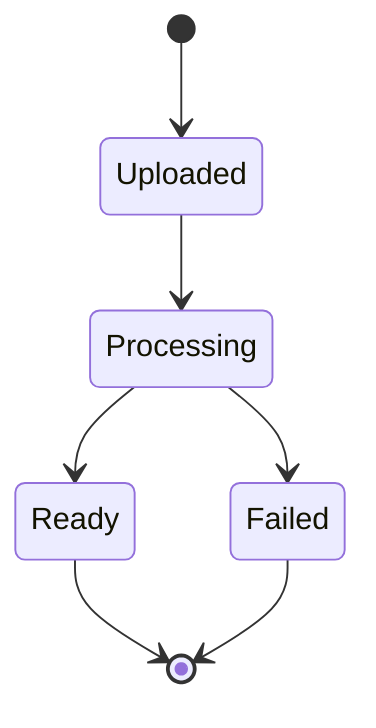
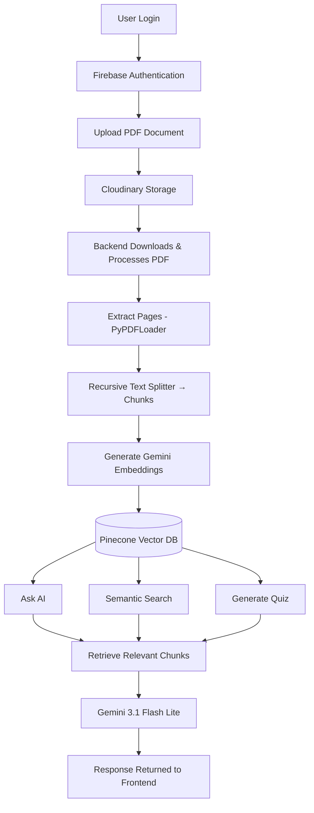

<div align="center">

# 🌽 CornPDF (Contextual Organization & Retrieval Network)

### AI-Powered PDF Question Answering & Document Intelligence Platform

Upload a PDF. Ask it anything. Get instant, context-aware answers — powered by Retrieval-Augmented Generation.

[](https://react.dev/)
[](https://vitejs.dev/)
[](https://www.djangoproject.com/)
[](https://www.python.org/)
[](https://ai.google.dev/)
[](https://www.pinecone.io/)
[](https://firebase.google.com/)
[](https://cloudinary.com/)
[](#-license)

<br>

[Overview](#-overview) •
[Features](#-features) •
[Architecture](#-architecture) •
[Tech Stack](#-tech-stack) •
[Roadmap](#-roadmap) •
[Contributing](#-contributing)

</div>

---

## 🧠 Overview

Reading lengthy academic books, research papers, documentation, or technical manuals is time-consuming.

**CornPDF** solves this by letting users:

| | |
|---|---|
| 📤 | Upload PDF documents |
| 💬 | Ask natural language questions |
| 🧾 | Generate AI summaries |
| 🔍 | Search semantically, beyond keywords |
| 📝 | Generate quizzes for self-assessment |

...without manually reading hundreds of pages.

CornPDF combines a modern **React + Django** full-stack application with **Retrieval-Augmented Generation (RAG)**, vector embeddings, semantic search, and **Google Gemini** models to deliver accurate, context-aware answers from large PDF documents.

---

## ✨ Features

<table>
<tr>
<td width="50%" valign="top">

### 🔐 Authentication
- Firebase Authentication
- Google Sign-In
- Token-based auth
- Protected routes

### 📂 Document Management
- Drag & drop PDF upload
- File validation & upload progress
- Secure storage via Cloudinary
- View / delete documents
- Live processing status

### 🤖 Ask AI (RAG)
- Natural language Q&A
- Semantic retrieval + context grounding
- Markdown-formatted answers
- Query history

</td>
<td width="50%" valign="top">

### 🔎 Semantic Search
- Meaning-based, not just keyword search
- Retrieves conceptually related sections
- e.g. searching *"Deadlocks"* surfaces *"Resource Allocation Cycle"*

### 🧾 AI Summarization
- Hierarchical map-reduce summarization
- Chunk → summarize → merge → final summary
- Scales to large documents

### 📝 AI Quiz Generation
- Configurable topic, difficulty & question count
- Auto-generated MCQs with explanations
- Interactive quiz UI

</td>
</tr>
</table>

### 📊 Document Status Lifecycle



---

## 🏗 Architecture



### PDF Processing Pipeline

```
PDF Upload → Cloudinary → Download PDF → PyPDFLoader → Text Extraction
    → Recursive Text Splitter → Chunk Generation → Database Storage
    → Gemini Embeddings → Pinecone Vector Database
```

Each chunk stores: **content**, **page number**, **chunk index**, **document ID**, **user ID**.

### RAG Retrieval Pipeline

```
Question → Generate Embedding → Pinecone Similarity Search
    → Top-K Relevant Chunks → Prompt Construction → Gemini LLM → Formatted Answer
```

---

## 🛠 Tech Stack

<table>
<tr><th>Layer</th><th>Technologies</th></tr>
<tr>
<td><b>Frontend</b></td>
<td>React.js · Vite · CSS3 · React Router · Firebase Auth · Fetch API</td>
</tr>
<tr>
<td><b>Backend</b></td>
<td>Django · Django REST Framework · Python</td>
</tr>
<tr>
<td><b>AI / ML</b></td>
<td>Google Gemini 3.1 Flash Lite · Gemini Embedding Model · LangChain · RAG</td>
</tr>
<tr>
<td><b>Vector Database</b></td>
<td>Pinecone — semantic search, context retrieval, similarity matching</td>
</tr>
<tr>
<td><b>Cloud Storage</b></td>
<td>Cloudinary — secure PDF storage</td>
</tr>
<tr>
<td><b>Database</b></td>
<td>SQLite (development) — users, documents, chunks, query history</td>
</tr>
</table>

---

## 📁 Project Structure

```
CornPDF_Main/
│
├── frontend/
│   ├── components/
│   ├── pages/
│   ├── Dashboard/
│   └── Firebase/
│
├── CornPDF_backend/
│   ├── ai_engine/
│   ├── documents/
│   ├── user_accounts/
│   ├── utils/
│   └── manage.py
│
└── README.md
```

## 🔒 Security

- Firebase Authentication with token verification
- User-specific document access & ownership validation
- Protected API endpoints
- Metadata filtering scoped to `document_id` and `user_id`

## ⚡ Performance Optimizations

- Lazy PDF loading via `PyPDFLoader.lazy_load()`
- Batch vector uploads to Pinecone
- Chunk-based processing (1000 chars, 200 overlap)
- Semantic retrieval instead of full-document prompting

---

## ⚠️ Current Limitations

| Limitation | Notes |
|---|---|
| Large PDFs (50 MB+) | Slower processing due to embedding generation |
| No background jobs yet | Users wait for processing to complete synchronously |
| SQLite in development | PostgreSQL recommended for production |

---

## 🗺 Roadmap

- [ ] Background processing with Celery + Redis
- [ ] Streaming PDF downloads for large files
- [ ] Real-time processing progress
- [ ] Quiz history & analytics dashboard
- [ ] OCR support for scanned PDFs
- [ ] Multi-document querying
- [ ] Conversation memory for AI chat
- [ ] Export summaries & quizzes (PDF/CSV)
- [ ] Role-based access control
- [ ] Docker deployment
- [ ] CI/CD pipeline
- [ ] PostgreSQL migration

---

## 📚 Key Learnings

Retrieval-Augmented Generation · Semantic search with vector databases · LLM integration · Prompt engineering · PDF parsing & chunking · Embedding generation · Vector similarity search · Full-stack development with React & Django · Firebase auth · Cloud storage · REST API design

---

## 🤝 Contributing

Contributions are what make the open-source community amazing! Any contributions are **greatly appreciated**.

1. Fork the project
2. Create your feature branch (`git checkout -b feature/AmazingFeature`)
3. Commit your changes (`git commit -m 'Add some AmazingFeature'`)
4. Push to the branch (`git push origin feature/AmazingFeature`)
5. Open a Pull Request

---

## 📄 License

Distributed under the **MIT License**. See `LICENSE` for more information.

---

<div align="center">

Made with ❤️ and a lot of ☕

⭐ If you found this project useful, consider giving it a star!

</div>
